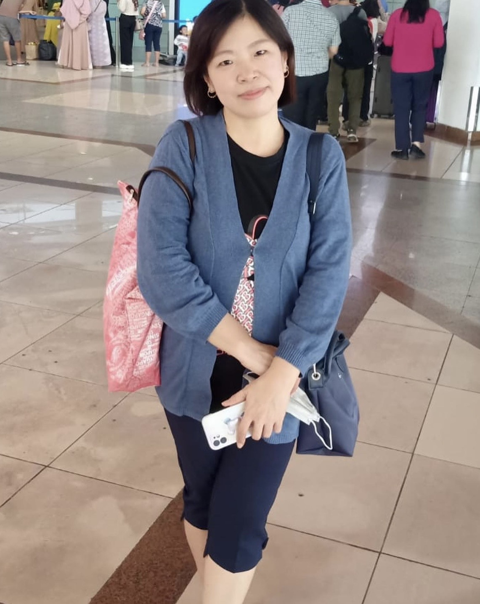
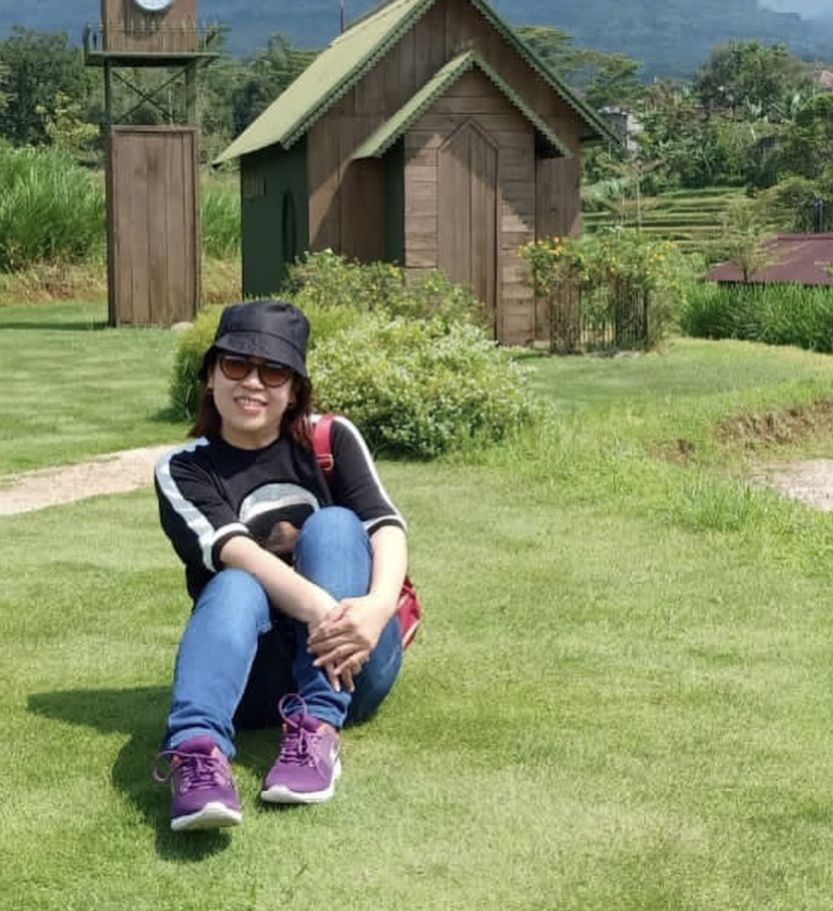
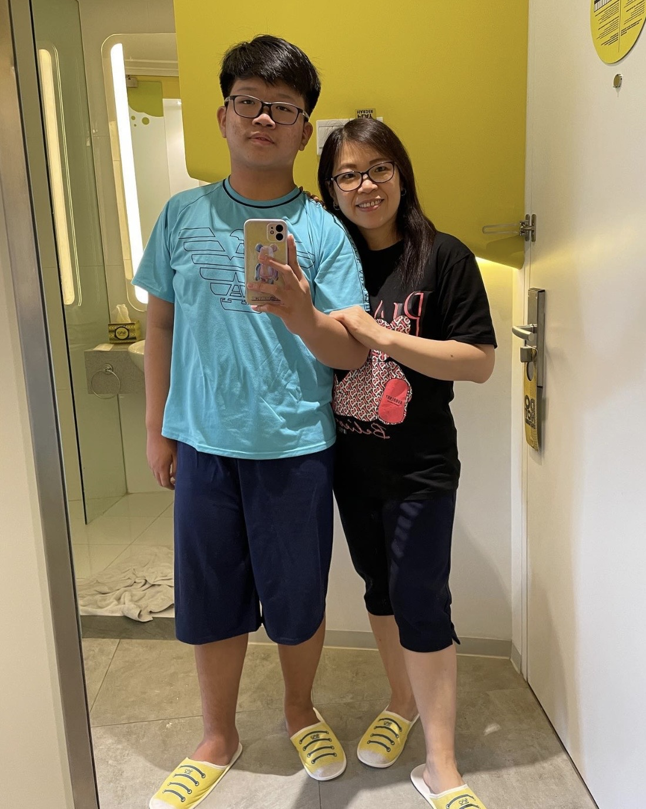

# Mother-s-day

<head>
    <meta charset="UTF-8">
    <meta name="viewport" content="width=device-width, initial-scale=1.0">
    <title>Selamat Hari Ibu, Mama!</title>
    <link href="https://fonts.googleapis.com/css2?family=Dancing+Script:wght@700&family=Montserrat:wght@300;500&display=swap" rel="stylesheet">
    
</head>
<body>

    <header>
        <h1>Happy Mother's Day</h1>
        
Terima kasih telah menjadi pelangi di setiap hariku, Ma.

    </header>

    

        

            
            

                
                
Mama harus terus sehat dan bahagia. Kami semua sayang mama dalam kondisi apapun.

            

            

                
                
Momen bahagia kita

            

            

                
                
Sehat selalu ya, Ma.... pokoknya harus terus ada sampai aku tuaaa

            

            

                
                
Terima kasih maa.., mama selalu ada buatku meski kadangkala diriku membuat amarah tongkat dewa😔

            

        

    

    <section class="personal-note">
        "mama adalah degup jantung di dalam rumah, dan tanpa mama, tidak ada detak jantung."  
        <strong>- I love you mom. kalau mama berdoa selalu namaku disebut, aku juga ma sellau menyebut mama dalam doa.</strong>
    </section>

    <footer>
        &copy; 2025 - Dibuat spesial untuk Hari Ibu
    </footer>

</body>

