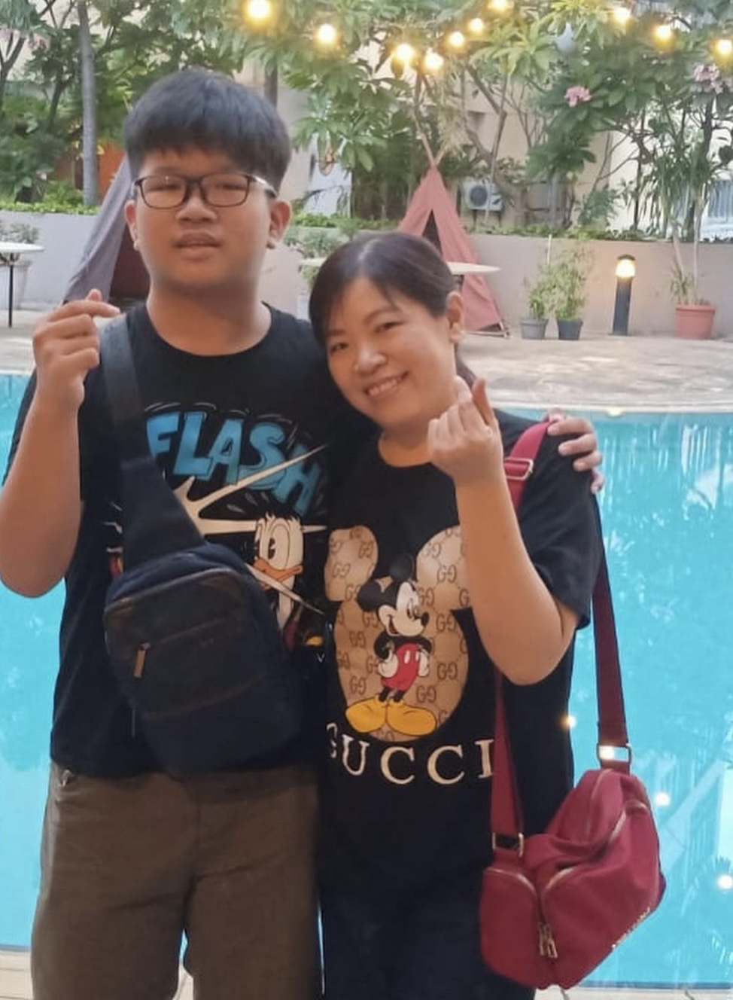

# Mother-s-day

<head>
    <meta charset="UTF-8">
    <meta name="viewport" content="width=device-width, initial-scale=1.0">
    <title>Selamat Hari Ibu, Mama!</title>
    <link href="https://fonts.googleapis.com/css2?family=Dancing+Script:wght@700&family=Montserrat:wght@300;500&display=swap" rel="stylesheet">
    
</head>
<body>

    

        <button class="heart-btn" onclick="bukaKado()">❤️</button>
        <h2>Ada kejutan buat Mama... <small>(Klik hatinya ya, Ma)</small></h2>
    

    <header>
        <h1>Happy Mother's Day</h1>
        
Terima kasih telah menjadi pelangi di setiap hariku, Ma.

    </header>

    

        

            
            

                
                
Mama harus terus sehat dan bahagia. Kami semua sayang mama.

            

            

                
                
Mama selalu ada buatku, sedangkan orang lain belum tentu ada buatku

            

            

                
                
Sehat selalu ya, Ma... harus ada sampai aku tua!

            

            

                
                
Terima kasih Mama selalu sabar menghadapiku.

            

        

    

    <section class="personal-note">
        "Mama adalah degup jantung di dalam rumah, dan tanpa mama, tidak ada detak jantung."  
        <strong>- I love you mom</strong>
    </section>

    <footer>
        &copy; 2025 - Dibuat spesial untuk Hari Ibu
    </footer>

    

</body>
